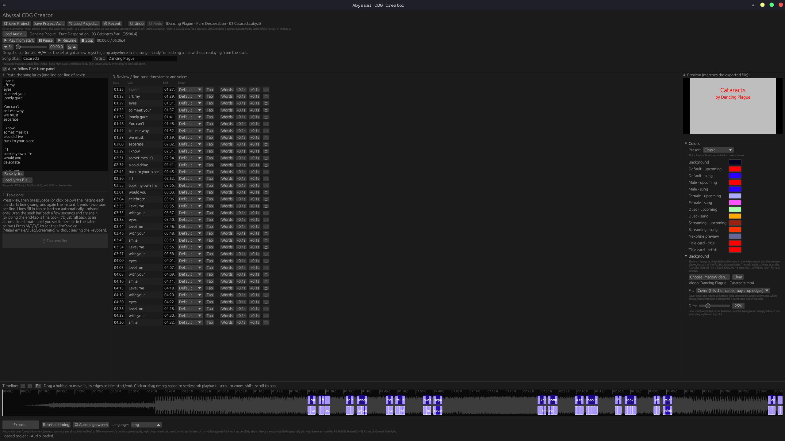
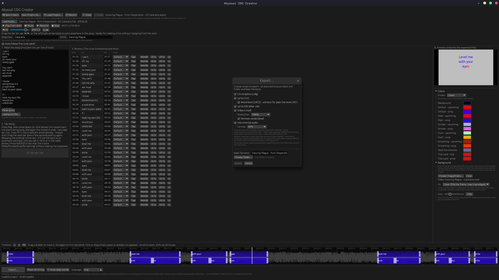
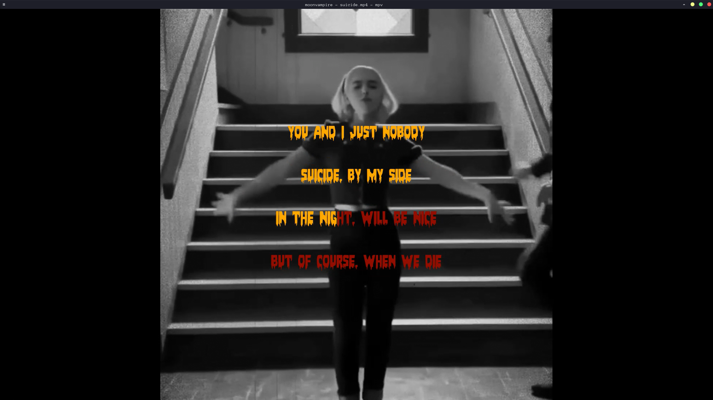

# Abyssal CDG Creator

A desktop application written in Rust and egui for creating real CD+G karaoke files from audio and lyrics.

Abyssal CDG Creator is designed for people who want to make karaoke tracks without fighting complex or outdated software. Import audio, paste lyrics, automatically align timing, customize colors and layout, and export authentic `.cdg` files compatible with karaoke players and MP3+G software.

Creating karaoke tracks still takes effort, but Abyssal CDG Creator aims to make the process faster, simpler, and more approachable.

**You're responsible for the audio/lyrics you use with this tool** - see [DISCLAIMER.md](DISCLAIMER.md).

[](https://github.com/AbyssalOath/abyssal-cdg/actions/workflows/ci.yml)
[](https://github.com/AbyssalOath/abyssal-cdg/releases/latest)


## Demonstrations






## What it does

Paste (or import) lyrics, load an audio file, and tap **Space** along with
the song to time each line - then export a real karaoke `.cdg` file, an
MP4 video, an instrumental/vocals-only copy of the audio, or LRC/UltraStar
lyrics files, any combination at once. A live preview shows exactly how
the export will look as you go, and everything is undoable (Ctrl+Z).

Highlights:

- **Two fine-tuning tools beyond tapping**: a draggable waveform timeline,
  and one-click **auto-align** (real speech-recognition, run against
  isolated vocals for better accuracy, to fill in word-level timing
  automatically) - best-effort, not perfect, so still worth a quick
  review before exporting.
- **Vocal removal** built in (a real ML separation model, not a filter
  trick) - for an instrumental/vocals-only export, or to sing against.
- **Custom colors/presets, a background image or video, and per-line
  Male/Female/Duet/Screaming voices** for duets and intense sections.
- **Imports** existing LRC, UltraStar, and KOK lyric files with their
  timing intact; **exports** to LRC/UltraStar too, not just `.cdg`/`.mp4`.

See [FEATURES.md](FEATURES.md) for the full walkthrough of every feature
above, plus known limitations.

## Installing a prebuilt release

Each [GitHub release](../../releases) includes a `.dmg` (macOS), `.msi`/`.exe`
installer (Windows), and `.AppImage`/`.deb` (Linux) - no Rust toolchain or
build step needed, and nothing else to separately install either: vocal
removal, video export, and the ONNX Runtime/ffmpeg they both depend on are
all bundled in (see [ARCHITECTURE.md](ARCHITECTURE.md#bundled-binaries-and-models-no-external-subprocess-dependencies-left)
for exactly what's bundled vs. downloaded automatically, and why). Two
things to know before you install:

- **Linux: the `.AppImage` won't run until you mark it executable.** Not
  specific to this app - plain HTTP downloads (any browser, `curl`, `wget`,
  ...) have no way to carry a file's Unix permission bits, so *every*
  AppImage from *every* project needs this once, right after downloading:
  ```bash
  chmod +x Abyssal-CDG-Creator_*.AppImage
  ```
  The `.deb` doesn't need this - `dpkg`/your package manager sets the right
  permissions on install.
- **macOS: "Apple could not verify... is free of malware."** This app isn't
  currently signed with a paid Apple Developer ID or notarized by Apple (that
  program costs $99/year), so Gatekeeper shows this warning on first launch
  for *any* app downloaded outside the App Store that isn't notarized - it's
  not a sign of anything actually wrong with the app. To open it anyway:
  right-click (or Control-click) the app in Finder and choose **Open**, then
  confirm **Open** in the dialog that appears (this only needs to be done
  once); or go to **System Settings -> Privacy & Security**, scroll to the
  blocked-app notice near the bottom, and click **Open Anyway**. If you'd
  rather not click through a warning at all, you can also strip the
  quarantine flag yourself in Terminal:
  ```bash
  xattr -d com.apple.quarantine "/Applications/Abyssal CDG Creator.app"
  ```
- **Windows: "Windows protected your PC" (SmartScreen)** can appear for the
  same reason (no paid code-signing certificate) - click **More info**, then
  **Run anyway**.

Neither warning means the download was tampered with; it's the standard
"nobody paid Apple/Microsoft to vouch for this build" message every
unsigned/unnotarized indie app shows. See
[SECURITY.md](SECURITY.md) if you want to verify what a release actually
does before running it - it's all open source, built by the same CI
workflow that produced the artifact.

## Building

You need a normal, reasonably current Rust toolchain (install via
[rustup](https://rustup.rs) if you don't have one - `rustc --version`
should be 1.88 or newer, ideally current stable; that floor comes from the
strictest MSRV among this project's own dependencies, `image`/`libloading`
- see [BUILD_TROUBLESHOOTING.md](BUILD_TROUBLESHOOTING.md) if `cargo
build` fails outright).

**MP4 video export and MP3 stem output** need `ffmpeg` (the `.cdg` export
and WAV output don't). A packaged release bundles its own custom-built
`ffmpeg`, so this is nothing to install for an installed copy of the app.
A `cargo run` dev build has no such bundle, so it falls back to a
system-installed `ffmpeg` on PATH:

```bash
# Debian/Ubuntu
sudo apt install ffmpeg
# macOS
brew install ffmpeg
# Windows: download from https://ffmpeg.org/download.html and add it to PATH
```

The app checks for `ffmpeg` before starting a video export and will tell
you clearly if neither is available, rather than failing silently.

**Vocal removal and auto-align** need nothing extra either - both run
their ONNX model in-process (no Python, no subprocess); the separation
model ships bundled, and auto-align's per-language models download/cache
on first use. See [ARCHITECTURE.md](ARCHITECTURE.md#bundled-binaries-and-models-no-external-subprocess-dependencies-left)
for exactly how all of this (ffmpeg, openh264, ONNX Runtime, the ML
models) is built/bundled/located, and why - none of it is a *build*-time
dependency (`cargo build`/`cargo test` need none of it, and make no
network requests); a `cargo run` dev build instead falls back to a local
cache directory, downloading into it on first use.

On Linux you'll also need the GTK3 and X11/Wayland development headers that
`rfd` (file dialogs) and `winit` (windowing) build against, plus ALSA's
development headers for `rodio`/`cpal` (audio playback) - most desktops
already have the ALSA *runtime* installed, but the `-dev`/`-devel` package
(with the `alsa.pc` pkg-config file) is a separate install, and its absence
is the most common "why won't this build" surprise on a fresh machine or a
minimal CI container:

```bash
# Debian/Ubuntu
sudo apt install libgtk-3-dev libxkbcommon-dev libx11-dev libasound2-dev pkg-config

# Fedora
sudo dnf install gtk3-devel libxkbcommon-devel libX11-devel alsa-lib-devel

# Arch
sudo pacman -S gtk3 libxkbcommon libx11 alsa-lib
```

macOS and Windows need no extra system packages - just Xcode Command Line
Tools / the MSVC build tools that `cargo` already expects.

Then, from this folder:

```bash
cargo build --release
cargo run --release
```

The first build will take a couple of minutes (it's pulling in a GUI
toolkit and an audio decoder); subsequent builds are fast.

### Running the test suite

The core logic - the CDG packet encoder, the font renderer, and the lyric
timing math - has unit tests that don't need any GUI/audio setup:

```bash
cargo test
```

## More documentation

- [DISCLAIMER.md](DISCLAIMER.md) - your responsibility for the audio/
  lyrics you use with this tool, separate from the software's own
  license.
- [FEATURES.md](FEATURES.md) - the full feature walkthrough, and known
  limitations/ideas for extending it.
- [ARCHITECTURE.md](ARCHITECTURE.md) - module layout, data flow, and the
  design decisions behind the two export pipelines.
- [CONTRIBUTING.md](CONTRIBUTING.md) - dev setup, coding conventions, and
  how to propose changes (including new lyric-file format support).
- [SECURITY.md](SECURITY.md) - this app's attack surface and how to report
  a vulnerability.
- [CHANGELOG.md](CHANGELOG.md) - notable changes by version.
- [BUILD_TROUBLESHOOTING.md](BUILD_TROUBLESHOOTING.md) - the most common
  build failure (an old Rust toolchain) and how to fix it.
- [THIRD_PARTY_LICENSES.md](THIRD_PARTY_LICENSES.md) - every bundled
  binary/model (ffmpeg, openh264, LAME, ONNX Runtime, the ML models) and
  their licenses, plus a full Rust dependency license report.

## Support the Project

If you find Abyssal CDG helpful, please consider supporting its development:

[Donate via Ko-fi](https://ko-fi.com/abyssaloath)
